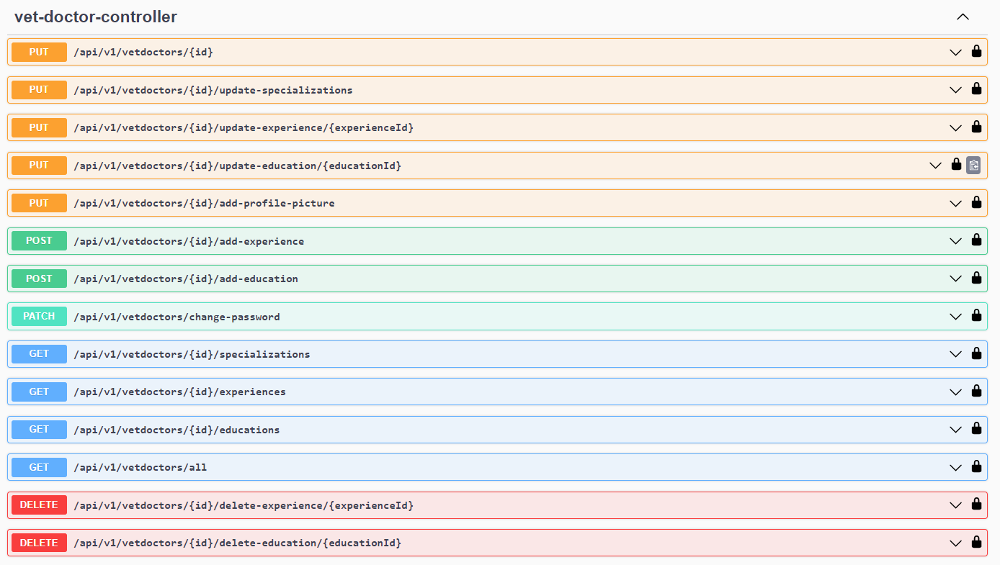
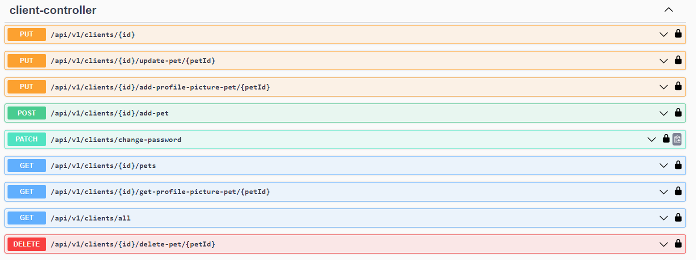
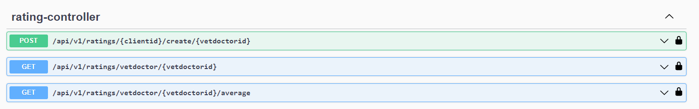
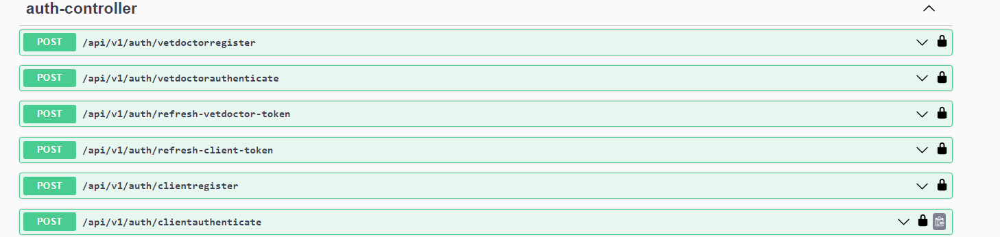
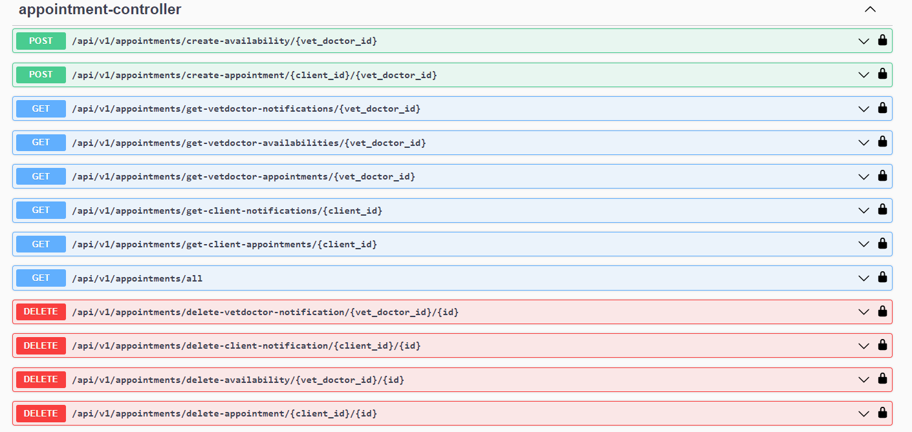

<a name="readme-top"></a>

<details>
  <summary>Table of Contents</summary>
  <ol>
    <li>
      <a href="#about-the-project">About The Project</a>
    </li>
    <li>
      <a href="#getting-started">Getting Started</a>
    </li>
    <li><a href="#built-with">Built With</a></li>
    <li><a href="#usage">Usage</a></li>
    <li><a href="#contributing">Contributing</a></li>
    <li><a href="#contact">Contact</a></li>
  </ol>
</details>


## About The Project

The VetAppointment Backend is the server-side component of a comprehensive system designed to streamline and enhance the management of veterinary appointments. This backend serves as the core of the VetAppointment ecosystem, offering the necessary functionality to support various features within the application.

Developed with efficiency and user-friendliness in mind, the VetAppointment Backend handles the logic and data management for services such as appointment scheduling, client and pet information, vet doctor profiles, educational backgrounds, and professional experience. It ensures secure and reliable communication with the front-end and provides a robust foundation for building a seamless veterinary appointment management system.

This backend is implemented using modern web technologies, including Java, Spring Boot, and various other libraries to ensure reliability, security, and scalability. It adheres to best practices for API design, authentication, and authorization, making it a solid choice for building a powerful and user-friendly veterinary appointment management solution.

<p align="right">(<a href="#readme-top">back to top</a>)</p>

## Getting Started

### Prerequisites

Before you begin, make sure you have the following prerequisites:

* Docker installed on your system.
* Docker Compose installed.
* Java IDE installed.

### Installation Steps

#### Clone the Repository:

Start by cloning the VetAppointment Backend repository to your local machine.

```
git clone https://github.com/Kinto2517/VetAppointmentBackend.git
```

#### Set Up Docker Compose File:

Create a docker-compose.yml file in the root directory where you cloned the repository.
```
version: "3"
services:
  zookeeper:
    image: wurstmeister/zookeeper
    ports:
      - "2181:2181"
  kafka:
    image: wurstmeister/kafka
    ports:
      - "9092:9092"
    environment:
      KAFKA_BROKER_ID: 101
      KAFKA_ADVERTISED_HOST_NAME: localhost
      KAFKA_ADVERTISED_PORT: 9092
      KAFKA_ZOOKEEPER_CONNECT: zookeeper:2181
    depends_on:
      - zookeeper
```

#### Starting The Project

Start the project with your favorite IDE with Docker running.

<p align="right">(<a href="#readme-top">back to top</a>)</p>

## Built With

* 
* 
* 

<p align="right">(<a href="#readme-top">back to top</a>)</p>


## Usage

### Vet Doctor Controller



* PUT /api/v1/vetdoctors/{id}: Update a VetDoctor's profile including City, Description, Phone Number, Name.
* PUT /api/v1/vetdoctors/{id}/update-specializations: Update a VetDoctor's specializations. This allows doctor to add pre-created specialization.
* PUT /api/v1/vetdoctors/{id}/update-experience/{experienceId}: Update a VetDoctor's experience that already created.
* PUT /api/v1/vetdoctors/{id}/update-education/{educationId}: Update a VetDoctor's education that already created.
* PUT /api/v1/vetdoctors/{id}/add-profile-picture: Add or update a VetDoctor's profile picture. You can upload "png", "jpg" or "jpeg" images.
* POST /api/v1/vetdoctors/{id}/add-experience: Add a new experience to a VetDoctor's profile.
* POST /api/v1/vetdoctors/{id}/add-education: Add a new education to a VetDoctor's profile.
* PATCH /api/v1/vetdoctors/change-password: Change the password for a VetDoctor. Spring security handle the authentication backend and makes sure that you change only your own password.
* GET /api/v1/vetdoctors/{id}/specializations: Retrieve a VetDoctor's specializations.

- These APIs for clients to see the doctors.
* GET /api/v1/vetdoctors/{id}/experiences: Retrieve a VetDoctor's experience records.
* GET /api/v1/vetdoctors/{id}/educations: Retrieve a VetDoctor's education records.
* GET /api/v1/vetdoctors/all: Retrieve information about all VetDoctors.

* DELETE /api/v1/vetdoctors/{id}/delete-experience/{experienceId}: Delete a specific experience record for a VetDoctor.
* DELETE /api/v1/vetdoctors/{id}/delete-education/{educationId}: Delete a specific education record for a VetDoctor.


### Client Controller


  

* PUT /api/v1/clients/{id}: Update a client's profile data.

* GET /api/v1/clients/{id}/pets: Retrieve a client's pet information.
* GET /api/v1/clients/{id}/get-profile-picture-pet/{petId}: Retrieve a pet's profile picture under a client's profile. 
* PUT /api/v1/clients/{id}/update-pet/{petId}: Update a pet's information under a client's profile.
* PUT /api/v1/clients/{id}/add-profile-picture-pet/{petId}: Add or update a pet's profile picture under a client's profile. You can upload "png", "jpg" or "jpeg" images.
* POST /api/v1/clients/{id}/add-pet: Add a new pet to a client's profile.
* DELETE /api/v1/clients/{id}/delete-pet/{petId}: Delete a specific pet under a client's profile.

* PATCH /api/v1/clients/change-password: Change the password for a client.
* GET /api/v1/clients/all: Retrieve information about all clients. /* This is a temp API call that will removed */

### Rating Controller:



* POST /api/v1/ratings/{clientid}/create/{vetdoctorid}: Create a rating for a vet doctor given by a client.
* GET /api/v1/ratings/vetdoctor/{vetdoctorid}: Get ratings for a specific vet doctor.
* GET /api/v1/ratings/vetdoctor/{vetdoctorid}/average: Get the average rating for a vet doctor.

### Auth Controller



* POST /api/v1/auth/vetdoctorregister: Register a new vet doctor.
* POST /api/v1/auth/vetdoctorauthenticate: Authenticate a vet doctor.
* POST /api/v1/auth/refresh-vetdoctor-token: Refresh a vet doctor's authentication token.
* POST /api/v1/auth/refresh-client-token: Refresh a client's authentication token.
* POST /api/v1/auth/clientregister: Register a new client.
* POST /api/v1/auth/clientauthenticate: Authenticate a client.

### Appointment Controller




* POST /api/v1/appointments/create-availability/{vet_doctor_id}: Create availability slots for a vet doctor.
* POST /api/v1/appointments/create-appointment/{client_id}/{vet_doctor_id}: Create a new appointment between a client and a vet doctor.
* GET /api/v1/appointments/get-vetdoctor-notifications/{vet_doctor_id}: Get notifications for a vet doctor.
* GET /api/v1/appointments/get-vetdoctor-availabilities/{vet_doctor_id}: Get availabilities for a vet doctor.
* GET /api/v1/appointments/get-vetdoctor-appointments/{vet_doctor_id}: Get appointments for a vet doctor.
* GET /api/v1/appointments/get-client-notifications/{client_id}: Get notifications for a client.
* GET /api/v1/appointments/get-client-appointments/{client_id}: Get appointments for a client.
* GET /api/v1/appointments/all: Retrieve information about all appointments.
* DELETE /api/v1/appointments/delete-vetdoctor-notification/{vet_doctor_id}/{id}: Delete a notification for a vet doctor.
* DELETE /api/v1/appointments/delete-client-notification/{client_id}/{id}: Delete a notification for a client.
* DELETE /api/v1/appointments/delete-availability/{vet_doctor_id}/{id}: Delete an availability slot for a vet doctor.
* DELETE /api/v1/appointments/delete-appointment/{client_id}/{id}: Delete an appointment for a client.

### Relation between the entities

* Client and Pet: One-to-many (Each client can have multiple pets, and each pet belongs to one client).
* Client and Appointment: One-to-many (Each client can have multiple appointments, and each appointment is associated with one client).
* Client and Notification: One-to-many (Each client can have multiple notifications).
* Client and ChatMessage: One-to-many (Each client can have multiple chat messages).
* Client and Review: One-to-many (Each client can write multiple reviews, and each review is associated with one client).

* VetDoctor and Appointment: One-to-many (Each vet doctor can have multiple appointments, and each appointment is associated with one vet doctor).
* VetDoctor and ratings: One-to-many (Each vet doctor can receive multiple reviews, and each review is associated with one vet doctor).
* VetDoctor and Specialization: Many-to-many (Each vet doctor can have multiple specializations, and each specialization can be associated with multiple vet doctors).
* VetDoctor and Notification: One-to-many (Each vet doctor can have multiple notifications).
* VetDoctor and Availability: One-to-many (Each vet doctor can have multiple availability entries).
* VetDoctor and ChatMessage: One-to-many (Each vet doctor can have multiple chat messages).

* Appointment and VideoConference: One-to-one (Each appointment can have one associated video conference).

<p align="right">(<a href="#readme-top">back to top</a>)</p>


## Contributing

Contributions are what make the open source community such an amazing place to learn, inspire, and create. Any contributions you make are **greatly appreciated**.

If you have a suggestion that would make this better, please fork the repo and create a pull request. You can also simply open an issue with the tag "enhancement".
Don't forget to give the project a star! Thanks again!

1. Fork the Project
2. Create your Feature Branch (`git checkout -b feature/AmazingFeature`)
3. Commit your Changes (`git commit -m 'Add some AmazingFeature'`)
4. Push to the Branch (`git push origin feature/AmazingFeature`)
5. Open a Pull Request

<p align="right">(<a href="#readme-top">back to top</a>)</p>


## Contact

* Ersin Yılmaz ASLAN - [My LinkedIn](https://tr.linkedin.com/in/ersinya)
* Project Link: [Vet Appointment Frontend](https://github.com/Kinto2517/vet-appointment-frontend)
* Backend Project Link: [Vet Appointment Backend](https://github.com/Kinto2517/VetAppointmentBackend)

<p align="right">(<a href="#readme-top">back to top</a>)</p>
